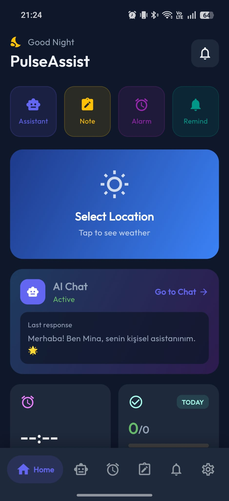
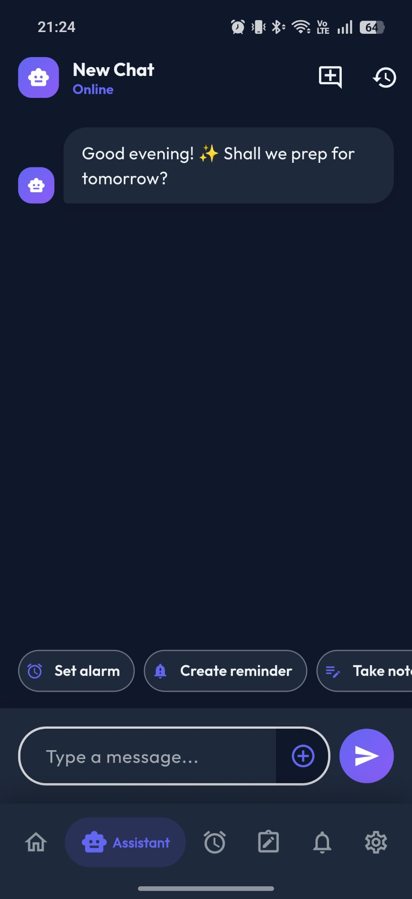
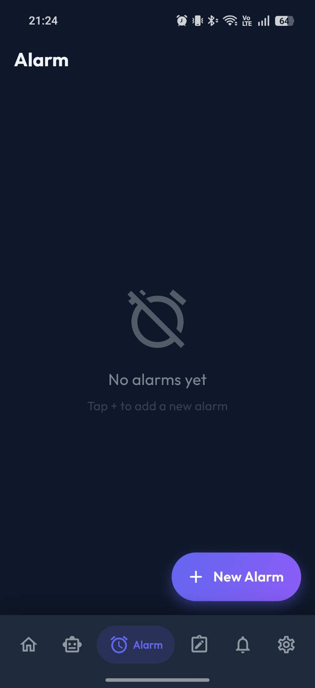
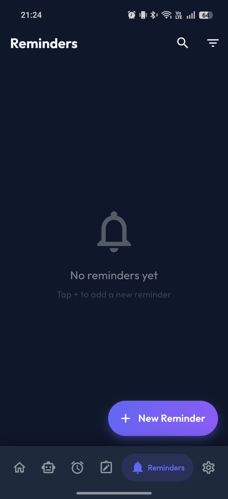
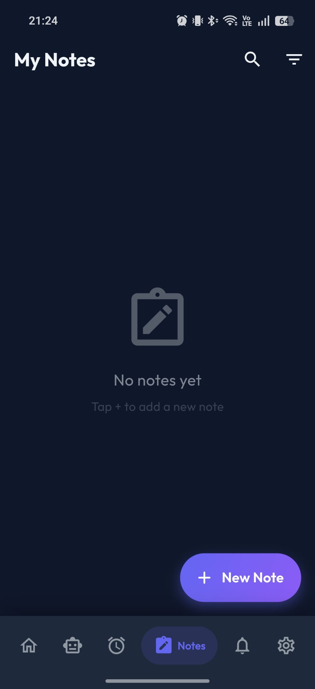
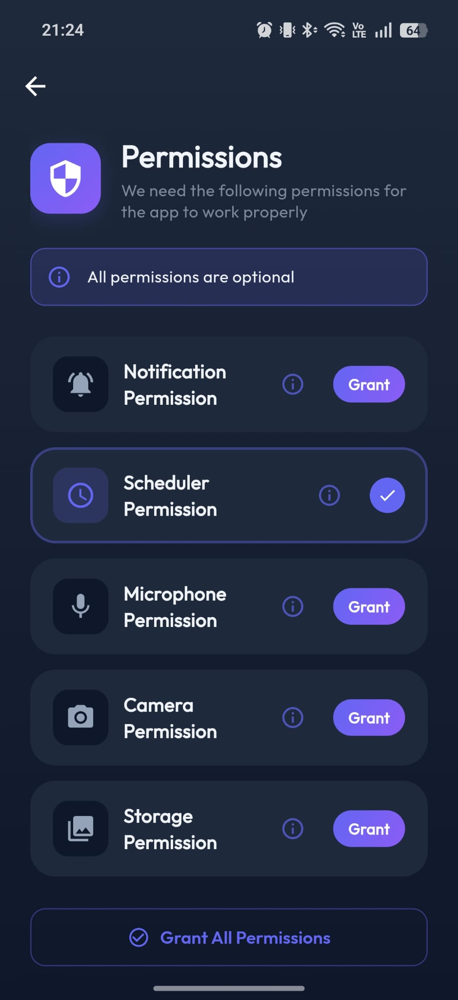
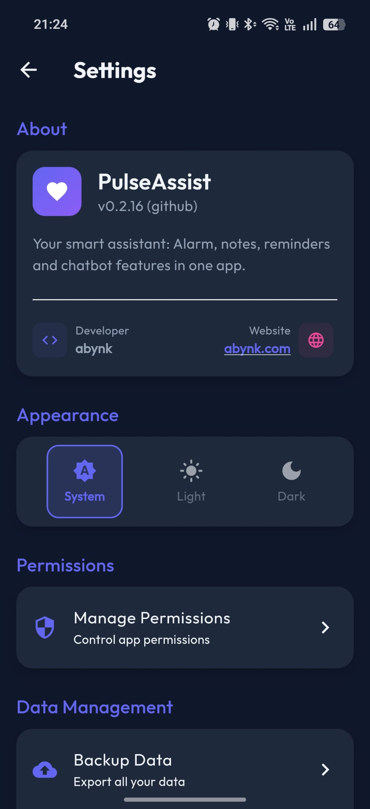
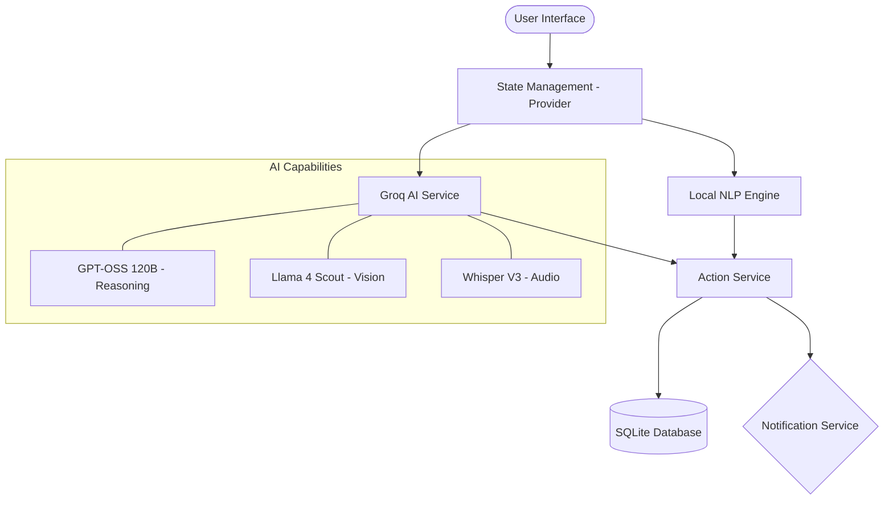

# 🤖 PulseAssist - Your Smart Personal Assistant

<div align="center">

[](https://flutter.dev)
[](https://dart.dev)
[](https://groq.com)
[](LICENSE)
[](#-multi-platform-support)

**PulseAssist** is a state-of-the-art, AI-powered personal assistant built with Flutter. It combines the power of LLMs (Groq Llama 3.3) with local NLP to provide a seamless, intuitive, and high-performance user experience across all major platforms.

> [!NOTE]
> **Project Status**: Most core features are fully functional. We are currently finalizing UI refinements and localization polishing.

[Features](#-key-features) • [Screenshots](#-screenshots) • [How it Works](#-how-it-works) • [API Setup](#-api-configuration) • [Tech Stack](#-tech-stack) • [Usage](#-usage)

</div>

---

## ✨ Key Features

### 🧠 Intelligent Chatbot (Multi-Model AI)
- **Hybrid AI Architecture**: Leverages multiple state-of-the-art models for specialized tasks:
- **Reasoning & Chat**: Powered by **GPT-OSS 120B** (Primary) and **Llama 3.3 70B** (Fallback).
  - **Interactive Slot Filling**: The assistant intelligently asks for missing details (e.g., "What time for the alarm?") instead of guessing.
  - **Offline Smart Chat**: Even without internet, the Local NLP engine tracks conversation context to support multi-turn commands naturally.
- **AI CRUD Operations**: Beyond simple chat, the AI can directly create, update, delete, and list:
  - ⏰ **Alarms**: Smart time parsing, recurring settings, and **Native System Ringtones**.
  - 📝 **Notes**: Structured note creation with template support (Shopping, Meeting, To-Do).
  - 🔔 **Reminders**: Priority-based tasks with local notifications.
- **Multimodal Capabilities**:
  - 👁️ **Vision & OCR**: Advanced object recognition and text extraction via **Llama 4 Scout 17B**.
  - 🎙️ **Audio Transcription**: High-accuracy voice-to-text using **Whisper Large V3**.
  - 📄 **PDF Analysis**: Upload and query PDF documents directly within the chat.

### 📍 Local Services & Regional Optimization (TR)
- **Turkey-Specific Logic**: Many core features are currently optimized specifically for **Turkey**:
  - 🌦️ **Weather**: City and district search is tailored for Turkish administrative regions.
  - 🏥 **Pharmacy**: Real-time "on-duty" (nöbetçi eczane) data via CollectAPI (TR focus).
  - 🎭 **Events**: Nearby event discovery via Ticketmaster localization for Turkey.
- **🌍 Multi-language Support**: Full support for both **Turkish (TR)** and **English (EN)**, adapting to system settings or manual choice.
- **🌓 Adaptive Themes**: Premium look with seamless switching between **Light** and **Dark** modes.
- **📊 Dashboard**: A beautiful, responsive dashboard providing a quick overview of your day.

### 🔒 Privacy & Security
- **Local-First Data**: All notes, alarms, and reminders are stored locally using **Hive** (NoSQL), providing blazing fast performace without cloud dependencies.
- **Secure Exports**: Backup and restore your data via encrypted ZIP files.
- **Secret Management**: API keys are managed via a local-only configuration file to ensure security.


---

## 📱 Screenshots

<div align="center">
  <table style="width:100%">
    <tr>
      <td width="33%"><br/><sub>Dashboard</sub></td>
      <td width="33%"><br/><sub>AI Chatbot</sub></td>
      <td width="33%"><br/><sub>Smart Alarms</sub></td>
    </tr>
    <tr>
      <td width="33%"><br/><sub>Reminders</sub></td>
      <td width="33%"><br/><sub>Rich Notes</sub></td>
      <td width="33%"><br/><sub>Privacy Controls</sub></td>
    </tr>
    <tr>
      <td colspan="3" align="center"><br/><sub>Settings</sub></td>
    </tr>
  </table>
</div>

---


## ⚙️ How it Works

PulseAssist uses a hybrid approach to natural language understanding:

1.  **Local NLP Layer**: For simple, privacy-sensitive tasks, a local NLP engine (built with Dart) classifies intents and extracts entities without needing an internet connection.
2.  **AI Intelligence Layer**: For complex requests, vision tasks, or audio analysis, the app leverages **Groq AI**. The AI is instructed to return structured JSON, which the app's **Action Service** executes directly.
3.  **Local Execution**: All actions (like setting an alarm or saving a note) happen on the device, ensuring your data stays yours.

---

## 🔑 API Configuration

To use all features of PulseAssist, you need to provide your own API keys. We use a template-based approach to keep your keys safe.
**New:** Supports **Multiple API Keys** (Failover) for uninterrupted service. If a primary key hits a rate limit, the system automatically switches to the next available key.

### 1. Register for API Keys

| Service | Purpose | Acquisition Link |
|---------|---------|------------------|
| **Groq AI** | Chat, Vision, Audio | [console.groq.com](https://console.groq.com/keys) |
| **OpenWeatherMap** | Weather Forecasts | [home.openweathermap.org](https://home.openweathermap.org/api_keys) |
| **CollectAPI** | Pharmacy Data (TR) | [collectapi.com](https://collectapi.com/tr/api/health/nobetci-eczane-api) |
| **Ticketmaster** | Local Events | [developer.ticketmaster.com](https://developer.ticketmaster.com) |

### 2. Setup your local config

1.  Navigate to `lib/config/`.
2.  Copy `api_config.example.dart` and rename it to `api_config.dart`.
3.  Open `api_config.dart` and paste your keys into the corresponding fields.

> [!TIP]
> `api_config.dart` is already added to `.gitignore`, so your keys will never be accidentally committed to your repository.

---

## 🏗 Project Architecture



### 🤖 Specialized AI Models

PulseAssist doesn't just use one model; it intelligently routes requests to the best available LLM for the task:

| Task | Primary Model | Role |
| :--- | :--- | :--- |
| **Core Chat & Logic** | `GPT-OSS 120B` | Advanced reasoning, structured JSON generation for actions. |
| **Fallback Chat** | `Llama 3.3 70B` | High-performance fallback for reliable general conversation. |
| **Vision & OCR** | `Llama 4 Scout 17B` | Analyzing images, identifying objects, and reading text. |
| **Voice / Audio** | `Whisper Large V3` | Industry-leading transcription for voice notes. |

---

---

## 🛠 Tech Stack

| Category | Technology |
|----------|------------|
| **Core** | [Flutter](https://flutter.dev), [Dart](https://dart.dev) |
| **State Management** | [Provider](https://pub.dev/packages/provider) |
| **Database** | [Hive](https://pub.dev/packages/hive) (Migrated from SQLite for speed) |
| **AI Models** | GPT-OSS 120B, Llama 4 Scout, Llama 3.3 70B, Whisper V3 |
| **UI Components** | flutter_quill, flutter_staggered_grid_view, google_fonts |

---

## 🚀 Installation & Build

### Prerequisites
- [Flutter SDK](https://docs.flutter.dev/get-started/install) (latest stable version)
- Java 17 (for Android build)

### Steps

1. **Clone & Install**:
   ```bash
   git clone https://github.com/your-username/pulse-assist.git
   cd pulse-assist
   flutter pub get
   ```

2. **Run the app**:
   ```bash
   flutter run
   ```

3. **Build APK**:
   ```bash
   flutter build apk --release
   ```

4. **Build App Bundle (Play Store)**:
   ```bash
   flutter build appbundle
   ```

---

## 📄 License

This project is licensed under the GNU GPLv3 License - see the [LICENSE](LICENSE) file for details.

---

<div align="center">
Made with ❤️ by [abynk](https://abynk.com)
</div>
