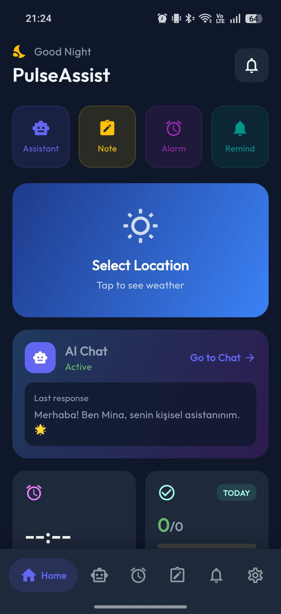
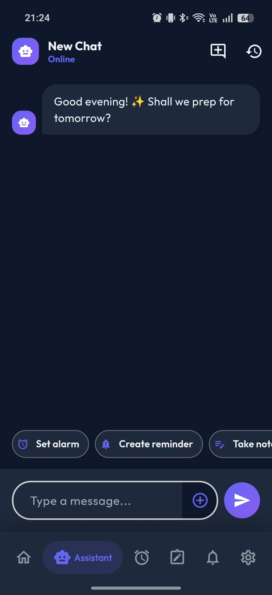
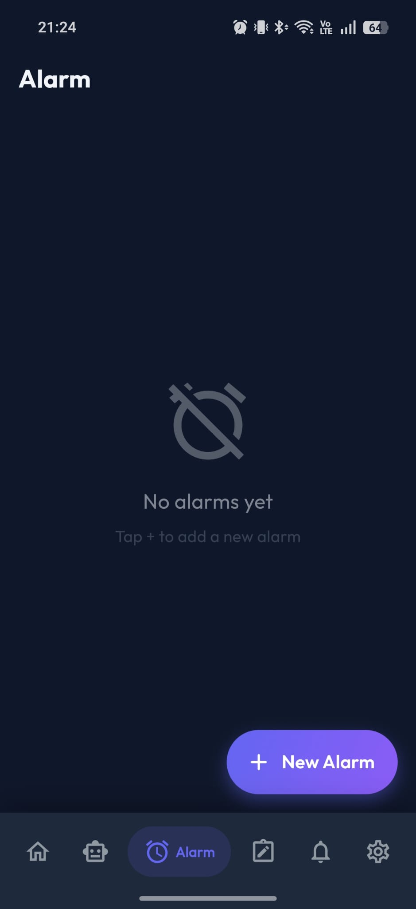
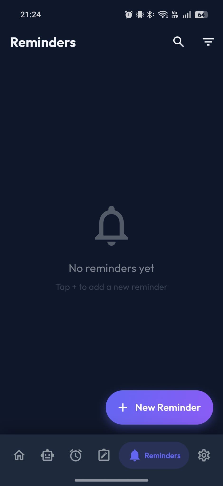
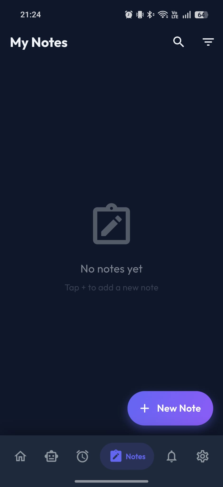
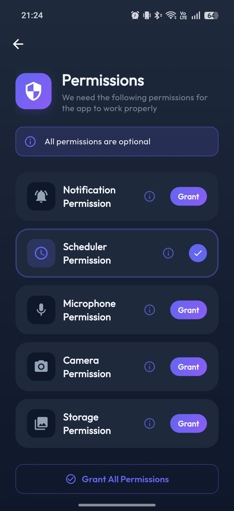
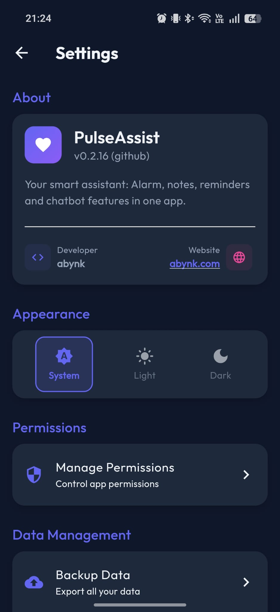
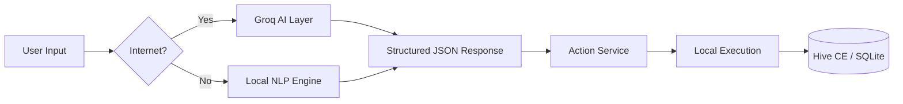
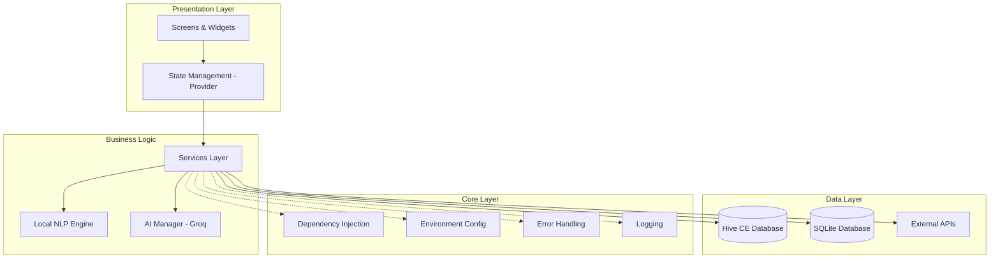

# 🤖 PulseAssist - Your Smart Personal Assistant

<div align="center">

[](https://flutter.dev)
[](https://dart.dev)
[](https://groq.com)
[](LICENSE)
[](#-multi-platform-support)
[](#)

**PulseAssist** is a state-of-the-art, AI-powered personal assistant built with Flutter. It combines the power of multiple LLMs via **Groq** (GPT-OSS 120B, Llama 4 Scout, Whisper V3) with a custom local NLP engine to provide a seamless, intuitive, and high-performance user experience across all major platforms.

> [!NOTE]
> **Project Status**: Most core features are fully functional. We are currently finalizing UI refinements and localization polishing.

[Features](#-key-features) • [Screenshots](#-screenshots) • [How it Works](#-how-it-works) • [API Setup](#-api-configuration) • [Tech Stack](#-tech-stack) • [Usage](#-usage)

</div>

---

## ✨ Key Features

### 🧠 Intelligent Chatbot — "Mina" (Multi-Model AI)
- **Hybrid AI Architecture**: Leverages multiple state-of-the-art models for specialized tasks:
  - **Reasoning & Chat**: Powered by **GPT-OSS 120B** (Primary) via Groq.
  - **Interactive Slot Filling**: The assistant intelligently asks for missing details (e.g., "What time for the alarm?") instead of guessing.
  - **Offline Smart Chat**: Even without internet, the Local NLP engine tracks conversation context to support multi-turn commands naturally.
- **Full AI CRUD Operations**: Beyond simple chat, the AI can directly **create, read, update, delete, and list**:
  - ⏰ **Alarms**: Smart time parsing, recurring settings, update/delete by time, and **Native System Ringtones**.
  - 📝 **Notes**: Structured note creation with template support (Shopping, Meeting, To-Do), append content, color coding.
  - 🔔 **Reminders**: Priority-based tasks (`low` / `medium` / `high` / `urgent`) with subtasks, toggle completion, and local notifications.
  - 📊 **Data Analysis**: AI can summarize your total alarms, notes, and reminders on demand.
- **Multimodal Capabilities**:
  - 👁️ **Vision & OCR**: Advanced object recognition and text extraction via **Llama 4 Scout 17B**.
  - 🎙️ **Audio Transcription**: High-accuracy voice-to-text using **Whisper Large V3**.
  - 📄 **Document Analysis**: Upload and query **PDF**, **DOCX**, **XLSX**, **CSV**, and **TXT** files directly within the chat.

### 🎨 Rich Content Creation
- **Drawing Canvas**: Built-in drawing screen with touch support for sketches and handwritten notes.
- **Voice Notes**: Record, playback, and manage voice memos with the integrated audio recorder and player.
- **Rich Text Notes**: Full rich-text editing powered by **Flutter Quill** with masonry grid layout and color-coded categories.

### 📍 Local Services & Regional Optimization (TR)
- **Turkey-Specific Logic**: Many core features are currently optimized specifically for **Turkey**:
  - 🌦️ **Weather**: City and district search is tailored for Turkish administrative regions (81 provinces + districts), with USA states data also available.
  - 🏥 **Pharmacy**: Real-time "on-duty" (nöbetçi eczane) data via CollectAPI (TR focus).
  - 🎭 **Events**: Nearby event discovery via Ticketmaster localization for Turkey.
- **🌍 Multi-language Support**: Full support for both **Turkish (TR)** and **English (EN)**, with ARB-based localization adapting to system settings or manual choice.
- **🌓 Adaptive Themes**: Premium look with seamless switching between **Light** and **Dark** modes, powered by a comprehensive theme system with Google Fonts.
- **📊 Dashboard**: A beautiful, responsive dashboard providing a quick overview of your day with weather, alarms, reminders, and more.

### 📱 Home Screen Widgets
- **Android Home Widget**: Quick-glance widget for your dashboard data directly on your home screen, powered by `home_widget` integration.

### 🔒 Privacy & Security
- **Local-First Data**: All notes, alarms, and reminders are stored locally using **Hive CE** (NoSQL) + **SQLite**, providing blazing fast performance without cloud dependencies.
- **Secure Exports**: Backup and restore your data via encrypted ZIP files.
- **Secret Management**: API keys are managed via a local-only configuration file (`.gitignore`'d) to ensure security.
- **Multiple API Key Failover**: Supports multiple Groq API keys with automatic rotation when hitting rate limits (30 RPM / 14400 RPD per key).
- **Legal Compliance**: Built-in Privacy Policy and Terms of Use screens.

---

## 📱 Screenshots

<div align="center">
  <table style="width:100%">
    <tr>
      <td width="33%"><br/><sub>Dashboard</sub></td>
      <td width="33%"><br/><sub>AI Chatbot</sub></td>
      <td width="33%"><br/><sub>Smart Alarms</sub></td>
    </tr>
    <tr>
      <td width="33%"><br/><sub>Reminders</sub></td>
      <td width="33%"><br/><sub>Rich Notes</sub></td>
      <td width="33%"><br/><sub>Privacy Controls</sub></td>
    </tr>
    <tr>
      <td colspan="3" align="center"><br/><sub>Settings</sub></td>
    </tr>
  </table>
</div>

---


## ⚙️ How it Works

PulseAssist uses a hybrid approach to natural language understanding:


```mermaid
flowchart LR
    A[User Input] --> B{Internet?}
    B -->|Yes| C[Groq AI Layer]
    B -->|No| D[Local NLP Engine]
    C --> E[Structured JSON Response]
    D --> E
    E --> F[Action Service]
    F --> G[Local Execution]
    G --> H[(Hive CE / SQLite)]
```

1.  **Local NLP Layer**: For simple, privacy-sensitive tasks, a custom NLP engine (built entirely in Dart) classifies intents, extracts entities with fuzzy matching, and preprocesses text — all without needing an internet connection.
2.  **AI Intelligence Layer**: For complex requests, vision tasks, document analysis, or audio transcription, the app leverages **Groq AI** with model-specific routing. The AI is instructed to return structured JSON, which the app's **Action Service** executes directly.
3.  **Local Execution**: All actions (like setting an alarm or saving a note) happen on the device, ensuring your data stays yours.

---

## 🔑 API Configuration

To use all features of PulseAssist, you need to provide your own API keys. We use a template-based approach to keep your keys safe.

> [!TIP]
> Supports **Multiple API Keys** (Failover) for uninterrupted service. If a primary key hits a rate limit, the system automatically switches to the next available key.

### 1. Register for API Keys

| Service | Purpose | Acquisition Link |
|---------|---------|------------------|
| **Groq AI** | Chat, Vision, Audio | [console.groq.com](https://console.groq.com/keys) |
| **OpenWeatherMap** | Weather Forecasts | [home.openweathermap.org](https://home.openweathermap.org/api_keys) |
| **CollectAPI** | Pharmacy Data (TR) | [collectapi.com](https://collectapi.com/tr/api/health/nobetci-eczane-api) |
| **Ticketmaster** | Local Events | [developer.ticketmaster.com](https://developer.ticketmaster.com) |

### 2. Setup your local config

1.  Navigate to `lib/core/config/`.
2.  Copy `api_config.example.dart` and rename it to `api_config.dart`.
3.  Open `api_config.dart` and paste your keys into the corresponding fields.

> [!TIP]
> `api_config.dart` is already added to `.gitignore`, so your keys will never be accidentally committed to your repository.

---

## 🏗 Project Architecture

PulseAssist follows **Clean Architecture** principles with a **senior-level project structure**:


```mermaid
graph TB
    subgraph "Presentation Layer"
        UI[Screens & Widgets]
        Providers[State Management - Provider]
    end
    
    subgraph "Business Logic"
        Services[Services Layer]
        NLP[Local NLP Engine]
        AI[AI Manager - Groq]
    end
    
    subgraph "Data Layer"
        HiveDB[(Hive CE Database)]
        SQLite[(SQLite Database)]
        APIs[External APIs]
    end
    
    subgraph "Core Layer"
        DI[Dependency Injection]
        Config[Environment Config]
        Error[Error Handling]
        Logging[Logging]
    end
    
    UI --> Providers
    Providers --> Services
    Services --> NLP
    Services --> AI
    Services --> HiveDB
    Services --> SQLite
    Services --> APIs
    
    Services -.-> DI
    Services -.-> Config
    Services -.-> Error
    Services -.-> Logging
```

### 📁 Project Structure

```
lib/
├── core/                    # Core architecture
│   ├── config/             # Environment-based configuration (Dev/Staging/Prod)
│   ├── constants/          # API & App constants
│   ├── data/               # Static data (Turkish cities, USA states)
│   ├── di/                 # Dependency injection (GetIt)
│   ├── error/              # Error handling & exceptions
│   ├── logging/            # Logging infrastructure
│   └── utils/              # Utilities & extensions (KeyManager, etc.)
├── l10n/                   # Localization (TR/EN ARB files)
├── models/                 # Data models (Hive CE type adapters)
│   ├── alarm.dart          # Alarm model with repeat days
│   ├── note.dart           # Rich note model with templates & colors
│   ├── reminder.dart       # Priority-based reminder with subtasks
│   ├── conversation.dart   # Chat conversation model
│   ├── message.dart        # Chat message model
│   ├── weather.dart        # Weather data model
│   └── ...                 # Event, Pharmacy, UserHabit, UserLocation, NotificationLog
├── providers/              # State management (7 providers)
│   ├── chat_provider.dart  # AI chat orchestration
│   ├── alarm_provider.dart # Alarm CRUD + ring handling
│   ├── note_provider.dart  # Note management
│   ├── reminder_provider.dart
│   ├── weather_provider.dart
│   ├── settings_provider.dart
│   └── notification_provider.dart
├── screens/                # UI screens (13 screens)
│   ├── dashboard_screen.dart
│   ├── chatbot_screen.dart
│   ├── alarm_screen.dart / alarm_ring_screen.dart
│   ├── notes_screen.dart / note_edit_screen.dart
│   ├── reminder_screen.dart
│   ├── drawing_screen.dart
│   ├── voice_note_screen.dart
│   ├── settings_screen.dart
│   ├── permissions_screen.dart
│   ├── splash_screen.dart
│   └── legal/              # Privacy Policy & Terms of Use
├── services/               # Business logic
│   ├── ai/                # AI services (AiManager, GroqProvider)
│   ├── nlp/               # NLP engine (5 modules)
│   │   ├── nlp_engine.dart
│   │   ├── intent_classifier.dart
│   │   ├── entity_extractor.dart
│   │   ├── fuzzy_matcher.dart
│   │   └── preprocessor.dart
│   ├── chat/              # Chat utilities (WelcomeGenerator)
│   ├── action_service.dart
│   ├── database_service.dart
│   ├── data_service.dart
│   ├── weather_service.dart
│   ├── pharmacy_service.dart
│   ├── events_service.dart
│   ├── notification_service.dart
│   ├── widget_service.dart
│   ├── system_ringtone_service.dart
│   └── learning_service.dart
├── widgets/                # Reusable widgets
│   ├── common/            # Buttons, TextFields, Dialogs
│   ├── note_sheet.dart
│   ├── voice_player.dart
│   ├── drawing_preview.dart
│   ├── quill_note_viewer.dart
│   └── location_selector_dialog.dart
└── theme/                  # App theming (Light & Dark)
```

### 🎯 Key Architecture Features

- **Environment-Based Config** — Dev, Staging, Production environments with separate database names & timeouts
- **Dependency Injection** — GetIt for loose coupling
- **Error Handling** — Custom exceptions and failures with `dartz` Either
- **Logging** — Environment-aware logging with Logger
- **Key Management** — Automatic API key rotation/failover for rate limits
- **Testing** — Comprehensive test infrastructure with unit, widget, and integration tests


### 🤖 Specialized AI Models

PulseAssist doesn't just use one model; it intelligently routes requests to the best available LLM for the task:

| Task | Model | Role |
| :--- | :--- | :--- |
| **Core Chat & Logic** | `GPT-OSS 120B` | Advanced reasoning, structured JSON generation for CRUD actions. |
| **Vision & OCR** | `Llama 4 Scout 17B` | Analyzing images, identifying objects, and reading text from photos. |
| **Voice / Audio** | `Whisper Large V3` | Industry-leading transcription for voice notes and audio files. |

### 🧠 Local NLP Engine

The custom-built NLP engine runs entirely on-device with **zero latency** and **no internet required**:

| Component | Purpose |
| :--- | :--- |
| **Intent Classifier** | Detects user intent (create alarm, note, reminder, cancel, etc.) |
| **Entity Extractor** | Parses time, dates, labels, priorities, and other entities from text |
| **Fuzzy Matcher** | Handles typos and approximate matching for robust input parsing |
| **Preprocessor** | Normalizes and tokenizes input text for both TR and EN |
| **NLP Engine** | Orchestrates all components into a unified pipeline |

For detailed architecture documentation, see [docs/ARCHITECTURE.md](docs/ARCHITECTURE.md).

---

## 🛠 Tech Stack

| Category | Technology |
|----------|------------|
| **Core** | [Flutter](https://flutter.dev) 3.x, [Dart](https://dart.dev) 3.10+ |
| **State Management** | [Provider](https://pub.dev/packages/provider) |
| **Database** | [Hive CE](https://pub.dev/packages/hive_ce) (NoSQL) + [SQLite](https://pub.dev/packages/sqflite) |
| **Dependency Injection** | [GetIt](https://pub.dev/packages/get_it) |
| **Logging** | [Logger](https://pub.dev/packages/logger) |
| **Error Handling** | [dartz](https://pub.dev/packages/dartz) (Either), [Equatable](https://pub.dev/packages/equatable) |
| **AI Integration** | [openai_dart](https://pub.dev/packages/openai_dart) (Groq-compatible) |
| **Networking** | [http](https://pub.dev/packages/http), [connectivity_plus](https://pub.dev/packages/connectivity_plus) |
| **Notifications** | [flutter_local_notifications](https://pub.dev/packages/flutter_local_notifications), [alarm](https://pub.dev/packages/alarm) |
| **Rich Text** | [flutter_quill](https://pub.dev/packages/flutter_quill) |
| **UI Components** | [flutter_staggered_grid_view](https://pub.dev/packages/flutter_staggered_grid_view), [google_fonts](https://pub.dev/packages/google_fonts), [cached_network_image](https://pub.dev/packages/cached_network_image) |
| **Media** | [image_picker](https://pub.dev/packages/image_picker), [record](https://pub.dev/packages/record), [audioplayers](https://pub.dev/packages/audioplayers), [file_picker](https://pub.dev/packages/file_picker) |
| **Document Parsing** | [read_pdf_text](https://pub.dev/packages/read_pdf_text), [archive](https://pub.dev/packages/archive) (DOCX), [justkawal_excel_updated](https://pub.dev/packages/justkawal_excel_updated) (XLSX) |
| **Content Rendering** | [flutter_markdown_plus](https://pub.dev/packages/flutter_markdown_plus), [flutter_linkify](https://pub.dev/packages/flutter_linkify), [url_launcher](https://pub.dev/packages/url_launcher) |
| **Home Widgets** | [home_widget](https://pub.dev/packages/home_widget) |
| **Testing** | Flutter Test, Mockito, Mocktail, Integration Test |
| **AI Models** | GPT-OSS 120B, Llama 4 Scout 17B, Whisper V3 |

---

## 🚀 Installation & Build

### Prerequisites
- [Flutter SDK](https://docs.flutter.dev/get-started/install) (3.x or later, SDK ≥ 3.10.4)
- Java 17 (for Android build)
- Android SDK 36 (API Level 36)
- Git

### Quick Start

1. **Clone the repository**:
   ```bash
   git clone https://github.com/your-username/PulseAssist-Personal-Smart-Assistant.git
   cd PulseAssist-Personal-Smart-Assistant
   ```

2. **Setup the project** (automated):
   ```bash
   make setup
   ```
   
   Or manually:
   ```bash
   flutter pub get
   flutter pub run build_runner build --delete-conflicting-outputs
   ```

3. **Configure API keys**:
   ```bash
   cp lib/core/config/api_config.example.dart lib/core/config/api_config.dart
   # Edit api_config.dart and add your API keys
   ```

4. **Run the app**:
   ```bash
   make run
   # or
   flutter run
   ```

### Build Requirements (Android)

| Requirement | Version |
|-------------|---------|
| **Android Gradle Plugin** | 8.11.1 |
| **Gradle** | 8.13 |
| **Compile SDK** | 36 |
| **Min SDK** | 24 (Android 7.0+) |
| **Target SDK** | 36 (Android 16) |
| **Java** | 17 |
| **Kotlin** | 2.1.10 |
| **NDK** | 28.2.13676358 |

### Development Commands

We provide a `Makefile` for common development tasks:

```bash
make help          # Show all available commands
make setup         # Initial project setup
make clean         # Clean build artifacts
make test          # Run all tests
make coverage      # Generate test coverage report
make analyze       # Run static analysis
make build-android # Build Android APK
make build-bundle  # Build Android App Bundle
make build-ios     # Build iOS app
make build-web     # Build web app
make build-all     # Build for all platforms
make run           # Run the app in debug mode
make run-dev       # Run with development environment
make run-prod      # Run with production environment
make deps          # Get dependencies
make generate      # Run build_runner code generation
make format        # Format code
make fix           # Apply dart fix
```

### Building for Production

**Android APK:**
```bash
make build-android
# or
flutter build apk --release
```

**Android App Bundle (for Play Store):**
```bash
make build-bundle
# or
flutter build appbundle --release
```

**Build outputs:**
- APK: `build/app/outputs/flutter-apk/app-release.apk`
- Bundle: `build/app/outputs/bundle/release/app-release.aab`

---

## 🧪 Testing

We maintain comprehensive test coverage with unit, widget, and integration tests.

**Run all tests:**
```bash
make test
```

**Generate coverage report:**
```bash
make coverage
```

**Test structure:**
- `test/unit/` — Unit tests for business logic
- `test/widget/` — Widget tests for UI components
- `test/helpers/` — Test utilities and mock factories
- `test/fixtures/` — Test fixture data

For detailed testing guidelines, see [docs/TESTING.md](docs/TESTING.md).

---

## 📚 Documentation

- [ARCHITECTURE.md](docs/ARCHITECTURE.md) — Detailed architecture overview
- [TESTING.md](docs/TESTING.md) — Testing guide and best practices
- [CONTRIBUTING.md](docs/CONTRIBUTING.md) — Contribution guidelines

---

## 🤝 Contributing

We welcome contributions! Please read our [Contributing Guidelines](docs/CONTRIBUTING.md) before submitting a pull request.

**Development workflow:**
1. Fork the repository
2. Create a feature branch
3. Make your changes
4. Run tests: `make test`
5. Run analysis: `make analyze`
6. Submit a pull request

---

## 📄 License

This project is licensed under the GNU GPLv3 License — see the [LICENSE](LICENSE) file for details.

---

<div align="center">
Made with ❤️ by <a href="https://abynk.com">abynk</a>
</div>
