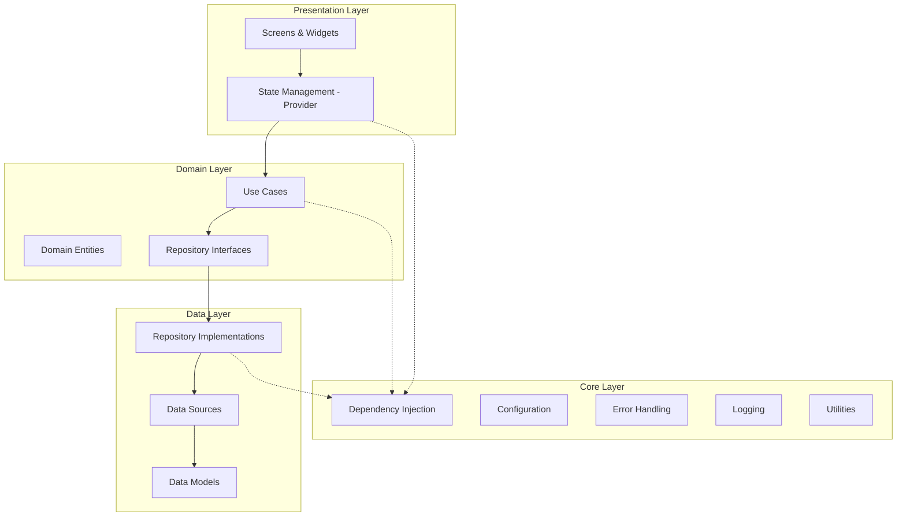

# PulseAssist Architecture

## Overview

PulseAssist follows a **Clean Architecture** pattern with **feature-based organization** to ensure scalability, maintainability, and testability.

## Architecture Layers



## Directory Structure

```
lib/
├── core/                      # Core functionality
│   ├── config/               # Configuration management
│   │   ├── app_config.dart   # Environment-based config
│   │   ├── environment.dart  # Environment enum
│   │   └── api_config.dart   # API keys (gitignored)
│   ├── di/                   # Dependency injection
│   │   └── service_locator.dart
│   ├── error/                # Error handling
│   │   ├── exceptions.dart
│   │   ├── failures.dart
│   │   └── error_handler.dart
│   ├── logging/              # Logging infrastructure
│   │   └── app_logger.dart
│   ├── constants/            # App constants
│   │   ├── app_constants.dart
│   │   └── api_constants.dart
│   └── utils/                # Utilities
│       ├── validators.dart
│       └── extensions.dart
│
├── features/                  # Feature modules (future)
│   ├── alarms/
│   ├── notes/
│   ├── reminders/
│   ├── chat/
│   └── ...
│
├── models/                    # Data models
├── providers/                 # State management
├── screens/                   # UI screens
├── services/                  # Business logic services
├── widgets/                   # Reusable widgets
├── theme/                     # App theming
├── l10n/                      # Localization
└── main.dart                  # App entry point
```

## Core Components

### 1. Configuration Management

**Environment-based configuration** with support for development, staging, and production:

- `Environment` enum for environment types
- `AppConfig` abstract class with environment-specific implementations
- `ConfigFactory` for runtime configuration selection

**Usage:**
```dart
// Initialize with environment
ConfigFactory.initialize(Environment.production);

// Access configuration
final config = ConfigFactory.config;
print(config.apiBaseUrl);
```

### 2. Dependency Injection

Using **GetIt** for service locator pattern:

- Centralized service registration in `service_locator.dart`
- Lazy singleton instances for services
- Easy testing with mock replacements

**Usage:**
```dart
// Get service instance
final logger = getIt<AppLogger>();
final db = getIt<DatabaseService>();
```

### 3. Error Handling

**Two-tier error handling:**

1. **Exceptions** - For throwing errors
2. **Failures** - For functional error handling with Either pattern

**Usage:**
```dart
try {
  // Operation
} on ServerException catch (e) {
  return Left(ServerFailure(e.message));
}
```

### 4. Logging

**Environment-aware logging** with different log levels:

```dart
final logger = AppLogger.instance;
logger.debug('Debug message');
logger.info('Info message');
logger.error('Error message', error, stackTrace);
```

## State Management

Using **Provider** pattern for state management:

- `ChangeNotifierProvider` for mutable state
- Separation of concerns between UI and business logic
- Easy testing with mock providers

## Data Layer

### Database

- **Hive** for local NoSQL storage (migrated from SQLite)
- Type-safe with code generation
- Fast and efficient

### Services

- **AI Manager** - Multi-provider AI service with fallback
- **NLP Engine** - Local natural language processing
- **Database Service** - Hive database wrapper
- **Notification Service** - Local notifications

## Testing Strategy

### Unit Tests
- Test individual functions and classes
- Mock dependencies using Mockito/Mocktail
- Located in `test/unit/`

### Widget Tests
- Test UI components in isolation
- Use `pumpApp` helper for setup
- Located in `test/widget/`

### Integration Tests
- Test complete user flows
- Located in `integration_test/`

## Best Practices

1. **Single Responsibility** - Each class has one responsibility
2. **Dependency Inversion** - Depend on abstractions, not concretions
3. **Immutability** - Use immutable data models where possible
4. **Error Handling** - Always handle errors gracefully
5. **Logging** - Log important events for debugging
6. **Testing** - Maintain >70% test coverage

## Future Improvements

1. **Feature-based Architecture** - Migrate to feature modules
2. **Use Cases** - Implement use case layer for business logic
3. **Repository Pattern** - Abstract data sources
4. **Bloc/Riverpod** - Consider alternative state management
5. **GraphQL** - For more efficient API communication
